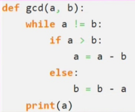

# __Документация к функции nod.py__
___

___

## Определение
Наибольший общий делитель двух целых чисел – это наибольшее натуральное целое число, делящее два данных целых числа. Для краткой записи наибольшего общего делителя часто используют аббревиатуру НОД – Наибольший Общий Делитель. Также наибольший общий делитель двух чисел m и n часто обозначают как НОД(m,n), gcd(m,n), hcf(m,n).

## Входные значения:

Наибольший общий делитель существует и однозначно определён, если хотя бы одно из чисел m или n не равно нулю.

Если одно число или все, наибольший делитель которых нужно найти, являются отрицательными числами, то их НОД равен наибольшему общему делителю модулей этих чисел. Это связано с тем, что противоположные числа a и −a имеют одинаковые делители, о чем мы говорили при изучении свойств делимости.

## Действия функции:

Создаем функцию gcd(a,b) с двумя вводными целыми числами(при этом одно из чисел a или b не равно нулю). Пока два числа не равны друг другу выполняется одно из двух действий:

1. Если первое число больше второго, то первое число заменяется на разность двух чисел(a - b)
2. Если второе число больше первого, то второе число заменяется на разность двух чисел(b - a)

Когда условие в цикле while перестает быть действительным,  к числу a присваивается конечное значение.

## Возвращаемые значения:

Вывод функции:

Функция выводит наибольший общий делитель двух целых чисел, который является натуральным целым числом.